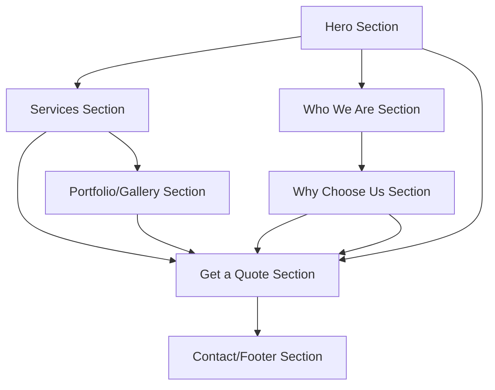

# Silver Pin Electrical Services - Product Requirements Document

## 1. Product Overview
Silver Pin Electrical Services website is a professional single-page application showcasing comprehensive electrical services with an integrated quote request system. The website serves as the primary digital presence for Silver Pin Electrical Services, targeting residential and commercial customers seeking reliable electrical solutions while establishing trust through professional presentation and easy contact methods.

## 2. Core Features

### 2.1 User Roles
No user role distinction is required for this website as it serves as an informational and lead generation platform for all visitors.

### 2.2 Feature Module
Our Silver Pin Electrical Services website consists of the following main sections:
1. **Hero Section**: Company branding, primary call-to-action, and navigation menu
2. **Services Section**: Comprehensive service offerings with detailed descriptions
3. **Get a Quote Section**: Interactive quote request form with contact fields
4. **Portfolio/Gallery Section**: Professional project showcase with image gallery
5. **Who We Are Section**: Company profile, team information, and credentials
6. **Why Choose Us Section**: Value propositions and competitive advantages
7. **Contact/Footer Section**: Contact information, service areas, and additional CTAs

### 2.3 Page Details

| Page Name | Module Name | Feature description |
|-----------|-------------|---------------------|
| Single Page Website | Hero Section | Display company logo, tagline "Powered by Integrity, Wired for Success", primary navigation menu, main CTA button, background with electrical service vehicle image |
| Single Page Website | Services Section | List all service offerings: 24/7 emergency electrical, residential/commercial solutions, maintenance/repair, renovation work, lighting upgrades, power system upgrades, heat pump installation, ventilation electrical work, alarm systems |
| Single Page Website | Get a Quote Section | Contact form with fields for name, email, phone, service type, project description, preferred contact method, submit button with validation |
| Single Page Website | Portfolio/Gallery Section | Image gallery showcasing completed electrical projects, before/after photos, project categories filter, lightbox view for detailed images |
| Single Page Website | Who We Are Section | Company history, team member profiles, certifications, licenses, years of experience, service area coverage |
| Single Page Website | Why Choose Us Section | Key value propositions: licensed & insured, honest pricing, timely service, quality work, 24/7 availability, local expertise |
| Single Page Website | Contact/Footer Section | Contact information, service hours, emergency contact, social media links, service area map, additional quote CTA |

## 3. Core Process

**Visitor Flow:**
Visitors land on the hero section, navigate through services to understand offerings, view portfolio for credibility, learn about the company in "Who We Are", understand value propositions in "Why Choose Us", and complete the journey by requesting a quote or contacting the company.

## 4. User Interface Design

### 4.1 Design Style
- **Primary Colors**: Professional blue (#1e40af), electrical orange/yellow accent (#f59e0b)
- **Secondary Colors**: Clean white (#ffffff), dark gray (#374151), light gray (#f3f4f6)
- **Button Style**: Rounded corners with hover effects, gradient backgrounds for primary CTAs
- **Font**: Modern sans-serif (Inter or similar), headings 24-48px, body text 16-18px
- **Layout Style**: Single-page scroll design with fixed navigation, card-based service sections, full-width hero and gallery sections
- **Icons**: Professional electrical and construction icons, simple line-style icons for services

### 4.2 Page Design Overview

| Page Name | Module Name | UI Elements |
|-----------|-------------|-------------|
| Single Page Website | Hero Section | Full-width background with electrical service vehicle, overlay text, prominent CTA button, sticky navigation bar, company logo |
| Single Page Website | Services Section | Grid layout with service cards, icons for each service, brief descriptions, "Learn More" buttons |
| Single Page Website | Get a Quote Section | Centered form with modern input fields, dropdown for service selection, textarea for description, prominent submit button |
| Single Page Website | Portfolio/Gallery Section | Masonry or grid layout for images, hover effects, category filters, modal/lightbox for enlarged views |
| Single Page Website | Who We Are Section | Split layout with team photo/company image, text content with credentials, certification badges |
| Single Page Website | Why Choose Us Section | Icon-based feature grid, brief descriptions, trust indicators like licenses and insurance |
| Single Page Website | Contact/Footer Section | Multi-column layout with contact info, service hours, emergency contact highlight, social media icons |

### 4.3 Responsiveness
The website is mobile-first responsive design with breakpoints for mobile (320px+), tablet (768px+), and desktop (1024px+). Touch-optimized navigation and form interactions for mobile devices, with smooth scrolling between sections and optimized image loading for performance.