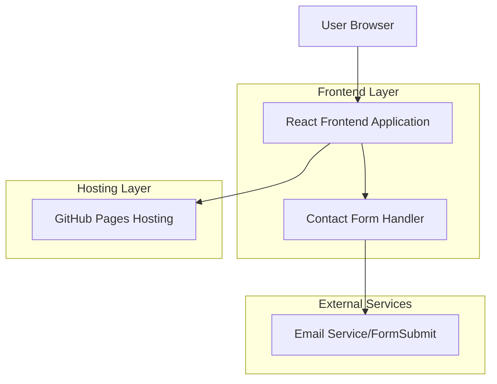
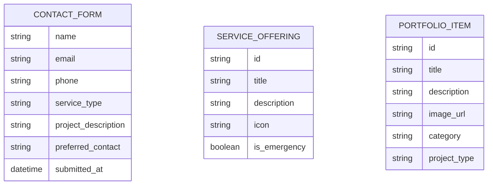

# Silver Pin Electrical Services - Technical Architecture Document

## 1. Architecture Design



## 2. Technology Description

- Frontend: React@18 + TypeScript + Tailwind CSS@3 + Vite
- Hosting: GitHub Pages (static deployment)
- Form Handling: FormSubmit.co or Netlify Forms (for contact/quote forms)
- Image Optimization: WebP format with lazy loading
- Animation: Framer Motion for smooth scrolling and transitions

## 3. Route Definitions

| Route | Purpose |
|-------|---------|
| / | Single-page application with all sections (Hero, Services, Quote, Portfolio, About, Contact) |
| /#hero | Hero section with company branding and main CTA |
| /#services | Services section displaying all electrical service offerings |
| /#quote | Get a quote form section for lead generation |
| /#portfolio | Portfolio/gallery section showcasing completed projects |
| /#about | Who We Are section with company information |
| /#why-choose-us | Why Choose Us section with value propositions |
| /#contact | Contact section with contact information and additional CTAs |

## 4. API Definitions

### 4.1 Core API

Contact/Quote Form Submission
```
POST https://formsubmit.co/{email}
```

Request:
| Param Name | Param Type | isRequired | Description |
|------------|------------|------------|-------------|
| name | string | true | Customer's full name |
| email | string | true | Customer's email address |
| phone | string | true | Customer's phone number |
| service_type | string | true | Type of electrical service needed |
| project_description | string | false | Detailed description of the project |
| preferred_contact | string | true | Preferred contact method (email/phone) |
| _subject | string | true | Email subject line |
| _captcha | boolean | true | Captcha verification |

Response:
| Param Name | Param Type | Description |
|------------|------------|-------------|
| success | boolean | Form submission status |
| message | string | Success or error message |

Example Request:
```json
{
  "name": "John Smith",
  "email": "john.smith@email.com",
  "phone": "+64 21 123 4567",
  "service_type": "Residential Electrical",
  "project_description": "Need electrical work for kitchen renovation",
  "preferred_contact": "phone",
  "_subject": "New Quote Request from Silver Pin Website",
  "_captcha": false
}
```

## 5. Data Model

### 5.1 Data Model Definition

Since this is a static website with no database, data is handled through:
- Static content stored in React components
- Form submissions sent via external form service
- Images stored in public assets folder
- Configuration data in JSON files



### 5.2 Static Data Structure

Services Configuration (services.json)
```json
[
  {
    "id": "emergency",
    "title": "24/7 Emergency Electrical Services",
    "description": "Round-the-clock emergency electrical repairs and troubleshooting",
    "icon": "lightning-bolt",
    "is_emergency": true
  },
  {
    "id": "residential",
    "title": "Residential Electrical Solutions",
    "description": "Complete electrical services for homes and residential properties",
    "icon": "home",
    "is_emergency": false
  }
]
```

Portfolio Configuration (portfolio.json)
```json
[
  {
    "id": "project-001",
    "title": "Commercial Office Lighting Upgrade",
    "description": "LED lighting installation for 500sqm office space",
    "image_url": "/images/portfolio/office-lighting.webp",
    "category": "commercial",
    "project_type": "lighting"
  }
]
```

Company Information (company.json)
```json
{
  "name": "Silver Pin Electrical Services",
  "tagline": "Powered by Integrity, Wired for Success",
  "phone": "+64 21 XXX XXXX",
  "email": "silverpinelectrical@gmail.com",
  "address": "Auckland, New Zealand",
  "licenses": ["EWRB Registered", "Fully Licensed & Qualified"],
  "service_areas": ["Auckland", "North Shore", "West Auckland"]
}
```